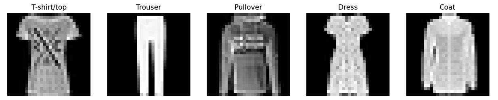
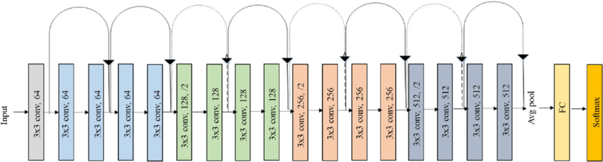
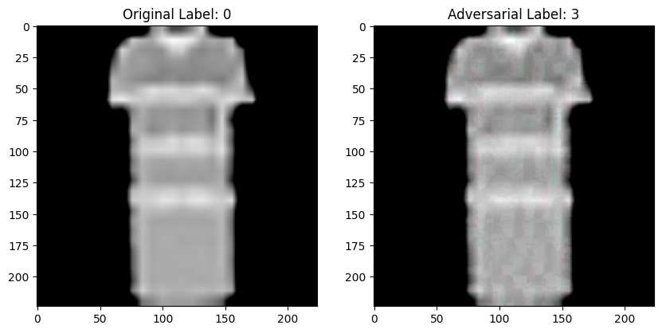
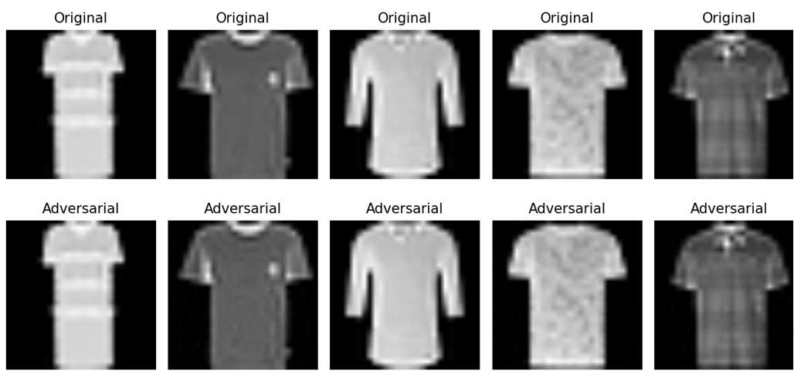

# 🔒 Imperceptible Adversarial Attacks Reproduction

  
  

A study in **Robust Deep Learning**: reproducing two optimization‐based adversarial attacks—PGD (L∞) and Carlini & Wagner (L₂)—on a ResNet‑18 model trained on Fashion‑MNIST. We evaluate both **attack success** and **imperceptibility** (SSIM, PSNR, L₂).

---

## 🎯 Objectives

- Reproduce **Projected Gradient Descent (PGD)** and **Carlini & Wagner (CW)** L₂ attacks  
- Quantify **attack success rates** and **perceptual distortion**  
- Compare PGD vs. CW on Fashion‑MNIST + ResNet‑18  

---

## 🧪 Experiment Reproduction

**Dataset**  
– Fashion‑MNIST: 60 000 train / 10 000 test, 28×28 grayscale images across 10 classes.

 

**Model**  
– ResNet‑18 (PyTorch), trained for 20 epochs, achieving ~93 % clean accuracy.

 

**Attacks Reproduced**  
1. **PGD (L∞)** — iterative gradient‑based within ε‑ball  

   The **Projected Gradient Descent (PGD)** attack is an iterative, gradient-based method designed to craft imperceptible adversarial examples that mislead deep neural networks.
   PGD iteratively computes the gradient of the loss with respect to the input image, applies a small perturbation in the gradient’s direction, and projects the result back into an epsilon-ball to ensure
   imperceptibility. This white-box attack leverages full access to the target model’s gradients, making it highly effective for generating adversarial examples.
      
      **Workflow**
      1. **Input Initialization**: Load an input image and its true label from the dataset.
      2. **Loss and Gradient Calculation**: Compute the CrossEntropyLoss and its gradient with respect to the input.
      3. **Perturbation Step**: Add a perturbation scaled by step size (α) in the direction of the gradient’s sign.
      4. **Projection**: Clamp the perturbation to stay within the L∞ norm bound (ε) and ensure the image remains in the valid range [-1, 1].
      5. **Iteration**: Repeat steps 2–4 for a fixed number of steps.
      6. **Output**: Generate the adversarial image for evaluation.
      
      **Implementation Details**
      - **Framework**: PyTorch
      - **Parameters**:
        - Epsilon (ε): 0.03 (L∞ norm bound)
        - Step size (α): 0.007
        - Number of steps: 10
      - **Attack Type**: White-box, untargeted
      - **Metrics Evaluated**: Attack success (accuracy drop), SSIM (structural similarity), PSNR (pixel distortion), and L2 norm (perturbation magnitude).
        
        
    
---
3. **CW (L₂)** — optimization‑based minimizing perturbation magnitude

   The CW L2 attack formulates adversarial example generation as an optimization problem. It minimizes the L2 norm of the perturbation while ensuring the model misclassifies the input by optimizing a loss function
   that compares the target class logit with the highest non-target logit. This white-box attack leverages full access to the model’s gradients, making it more precise than iterative gradient-based methods like PGD.

   **Workflow**
    1. **Input Initialization**: Load an input image and its true label from the dataset.
    2. **Loss Definition**: Compute the CW loss, combining:
       - The L2 norm of the perturbation (difference between original and adversarial images).
       - A misclassification term (difference between the correct class logit and the maximum non-target logit, clamped to ensure misclassification).
    3. **Optimization**: Use an Adam optimizer to iteratively adjust the adversarial image, minimizing the total loss.
    4. **Clamping**: Ensure the adversarial image remains in the valid range [-1, 1].
    5. **Early Stopping**: Stop optimization if the attack successfully misclassifies all images in the batch.
    6. **Output**: Generate the adversarial image for evaluation.

    **Implementation Details**
    - **Framework**: PyTorch
    - **Parameters**:
      - Confidence parameter (c): 2.0
      - Number of steps: 100
      - Learning rate (lr): 0.01
    - **Attack Type**: White-box, untargeted, L2 norm optimization
    - **Metrics Evaluated**: Attack success (accuracy drop), SSIM (structural similarity), PSNR (pixel distortion), and L2 norm (perturbation magnitude).

        
---

## 📊 Results Overview

| Metric                   | PGD Attack     | CW Attack      |
|--------------------------|----------------|----------------|
| Adversarial Accuracy     | 0.40 %         | 0.00 %         |
| SSIM                     | 0.9625         | 0.9762         |
| PSNR (dB)                | 33.07          | 39.65          |
| Avg L₂ Perturbation      | 8.63           | 6.51           |

> **Takeaway:** CW achieves complete misclassification with smaller, more imperceptible perturbations than PGD.

---

## 🔮 Conclusion

In this reproduction of two cornerstone adversarial attacks, we demonstrate:

- **Severe Vulnerability**: ResNet‑18 on Fashion‑MNIST is driven from ~93% clean accuracy to near 0% under both PGD and CW.  
- **Imperceptibility vs. Effectiveness**:  
  - PGD degrades accuracy effectively but leaves more visible perturbations.  
  - CW achieves complete misclassification with less distortion, as confirmed by higher SSIM/PSNR and lower L₂ norms.  
- **Implications for Robust DL**: These results underscore the urgent need for defenses—adversarial training, certified robustness, and hybrid pixel‑ & latent‑space methods—to guard against optimization‑based attacks that remain virtually invisible to human observers.  
- **Broader Impact**: In safety‑critical domains (e.g., autonomous driving, medical imaging, supply‑chain visual QA), such imperceptible attacks pose real threats. Future work must prioritize both defense efficacy and interpretability to ensure model reliability.

---

## 🔮 Future Work

- Test **transferability** across VGG, DenseNet, Transformers  
- Scale to **color** & **high‑res** datasets (CIFAR, ImageNet)  
- Incorporate **semantic‑aware** and **latent‑space** perturbations  

---
